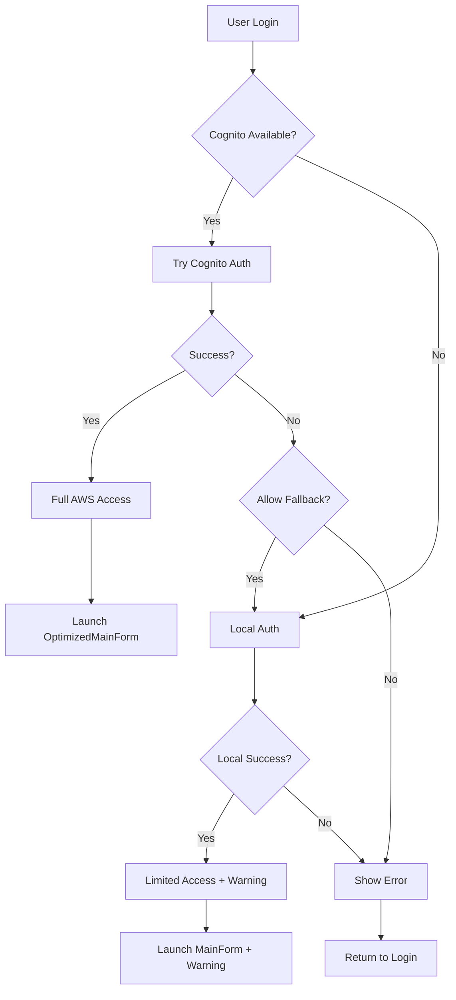

# Unified Authentication System Documentation

## Overview

The Unified Authentication System consolidates the previous dual authentication approach (Cognito and Local) into a single, secure, and user-friendly interface that addresses critical security vulnerabilities.

## Key Security Improvements

### 1. **Credential Validation**
- All S3 operations now validate AWS credentials before execution
- Prevents runtime failures when local users attempt S3 operations
- Clear error messages guide users to proper authentication methods

### 2. **Security Warnings**
- Users without AWS credentials receive prominent warnings
- Clear indication of access limitations
- Guidance on obtaining full access through proper authentication

### 3. **Automatic Fallback**
- Primary: AWS Cognito authentication (full access)
- Fallback: Local authentication with limited access warnings
- Graceful degradation when Cognito services are unavailable

## New Components

### Models

#### `UnifiedUser.cs`
Unified user abstraction that works with both authentication types:
- Supports both Cognito and Local user properties
- Consistent role and permission handling
- AWS credential management and validation
- Helper methods for capability assessment

#### `AuthenticationResult.cs`
Standardized authentication result handling:
- Success/failure status with detailed error messages
- Warning management for limited access scenarios
- Method tracking (Cognito Online, Offline, Local, Fallback)

### Services

#### `UnifiedAuthService.cs`
Consolidated authentication service:
- Automatic method selection with fallback
- Cognito offline support with cached credentials
- Local authentication for backward compatibility
- Comprehensive error handling and user guidance

### Forms

#### `UnifiedLoginForm.cs`
Single login interface replacing duplicate forms:
- Automatic authentication method detection
- Progressive disclosure of options
- Clear status indicators and help guidance
- Support for offline mode and cached credentials

## Authentication Flow

## Security Model

### Full Access (Cognito Users)
- AWS credentials from Cognito Identity Pool
- Role-based permissions via AWS IAM
- All S3 operations available
- Offline support with cached credentials

### Limited Access (Local Users)
- No AWS credentials by default
- Role selection for application features
- S3 operations blocked with clear error messages
- Warning messages about access limitations

### Migration Path
Local users can be migrated to Cognito authentication by:
1. Setting up AWS Cognito User Pool
2. Adding users to appropriate groups
3. Configuring Identity Pool for temporary credentials
4. Users login with same credentials via Cognito

## Error Handling

### Authentication Errors
- Network connectivity issues with Cognito
- Invalid credentials for either method
- Service unavailability scenarios
- Configuration problems

### S3 Operation Errors
- Clear messages when credentials are missing
- Guidance on resolving authentication issues
- Fallback options when available

### User Guidance
- Help dialog with troubleshooting steps
- Progressive error messages with solutions
- Contact information for administrator support

## Configuration

The unified system respects existing configuration:
- AWS settings for S3 access
- Cognito settings for user pool integration
- Performance settings for optimized operations
- Offline mode settings for cached credentials

## Backward Compatibility

### Existing Forms
- `LoginForm.cs` and `CognitoLoginForm.cs` remain functional
- Deprecated but not removed to avoid breaking changes
- Can be removed in future versions after migration period

### Service Integration
- `S3Service.cs` enhanced with credential validation
- `OptimizedS3Service.cs` updated for UnifiedUser support
- Existing method signatures preserved where possible

## Testing Scenarios

### Happy Path
1. Cognito user logs in successfully
2. Gets full AWS access
3. Can perform all S3 operations

### Fallback Scenarios
1. Cognito unavailable → Falls back to local auth
2. Cognito auth fails → Tries local auth if allowed
3. Local user → Gets limited access warning

### Error Scenarios
1. No authentication methods available
2. Invalid credentials for all methods
3. Network issues preventing Cognito access
4. S3 operations with missing credentials

## Future Enhancements

1. **Credential Mapping**: Map local users to Cognito users
2. **Read-Only Mode**: Allow limited S3 read access for local users
3. **Session Management**: Enhanced token refresh and management
4. **Audit logging**: Track authentication events and failures
5. **Multi-Factor Authentication**: Support for MFA in Cognito

## Migration Guide

### For Administrators
1. Review existing user authentication patterns
2. Plan Cognito User Pool setup if not already configured
3. Test unified authentication in development environment
4. Migrate users gradually with proper communication

### For Users
1. No immediate changes required
2. Enhanced security warnings guide proper authentication
3. Contact administrator for Cognito access if needed
4. Existing local authentication continues to work

## Support and Troubleshooting

### Common Issues
1. **"No AWS credentials available"**: User needs Cognito authentication
2. **"Authentication service unavailable"**: Check network and configuration
3. **"Limited access mode"**: User authenticated locally, needs Cognito for full access

### Resolution Steps
1. Check network connectivity for Cognito
2. Verify AWS configuration settings
3. Ensure Cognito User Pool is properly configured
4. Contact administrator for proper authentication setup